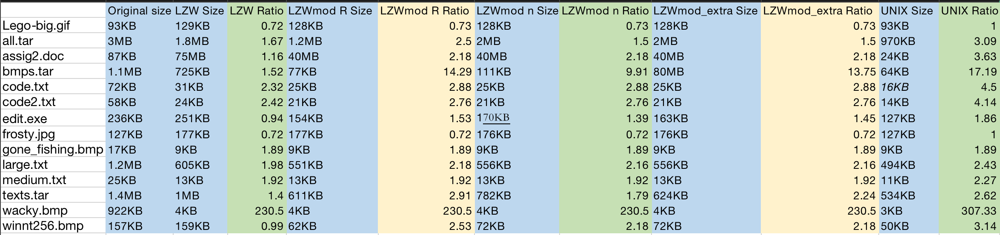

# a3.md

The above is the screenshot of my tests table. In this project, I tested on 14 test files and for each test file, I recorded 6 cases:

1. its original file size.
2. the size after compressing using LZW.java.
3. the size after compressing using [LZWmod.java](http://lzwmod.java) with resetting dictionary when its full.
4. the size after compressing using [LZWmod.java](http://lzwmod.java) without resetting dictionary when its full.
5. the size after compressing using [LZWmod_extra.java](http://lzwmod.java) which automatically decides whether or not to reset dictionary. 
6. the size after compressing by Mac.

I will analyze these 6 cases for each test file in the following:

1. Lego-big.gif and frosty.jpg:
    - **The WORST COMPRESSION OCCURRED IN IMAGE FILES like gif and jpg.** The file size after compression by LZW compression(including  LZW.java, [LZWmod.java](http://lzwmod.java) ,  [LZWmod_extra.java](http://lzwmod.java)) both become bigger than original file size. As we learned in class, images compress really badly often. The reason is that most common image formats (like jpg, png, gif) are already compressed(gifs are already compressed using LZW algorithm, jpgs are already compressed by jpeg), so as we apply LZW on .gif and .jpg files again, the quality will just deteriorate each time. Also, pictures usually have way larger number of data than txt files and there are more random data, so pictures are complex and have little repetition that is long enough to be worth compressing. In other word, there is a large degree of heterogeneity in the images, so it's hard to build up large prefixes. Hence, we cannot get much savings. So when we add more compression on them, the compressed files could even be (slightly) larger because the compression algorithm has no benefit on compressed data since most of the data will not repeat and for each unique data, we created a new one to replace it in LZW, and then the format (eg. gzip) has to add header and/or structure information to the output.
2. code.txt, code2.txt, large.txt, medium.txt, assig2.doc, edit.exe:
    - This six files size after compression by LZW compression(including  LZW.java, [LZWmod.java](http://lzwmod.java) ,  [LZWmod_extra.java](http://lzwmod.java)) have reduced and their compression ratio is roughly from 1.50-3.00. On average, they are reduced by half. This is because they are all text files. LZW is useful for text files since in text files there are more repeated data so the LZW can replace lots of longer length data with shorter length data. The more duplicate data in files, the higher the compression efficiency the files have. And I noticed that for most of the test files of the six, the LZWmod.java with or without resetting dictionary has the same compression size and they all less than the LZW.java. This is because of the variable bit codewords used by the non-LZW algorithms, which allows us to compress the same information into a smaller space than the 12-bit fixed-size codewords used in LZW. The reason why there was no difference between the LZW with no reset and LZW with reset is because the file was not large enough for the codebook to become full and reset functionality will not be triggerred. For edit.exe, LZWmod.java with no reset has slightly worse performance than with reset but it's still better then original LZW because of the use of variable-bit codewords.
3. wacky.bmp, winnt256.bmp, gone_fishing.bmp.Z:
    - Although bmp and jpg are both graphic files, bmp files are uncompressed bitmapped images, and jpg are compressed digital images. For compressed files, it is harder to be compressed again. For uncompressed one, things are easier. Especially,  **wacky.bmp** has the **BEST COMPRESSION PERFORMANCE**. Its compression ratio is over 230. This is probably because the file has very low information entropy and very long prefixes can therefore be formed by the algorithms (since the image is mostly a solid white background, this makes sense). For gone_fishing.bmp.Z, all the compression ratio is the same due to the fact that the file is not large enough to trigger resetting codebook.  
4. bmps.tar, all.tar, texts.tar: 
    - All the tar files have relatively good compression performance especially the bmps.tar since all the independent bmps files have very good compression performance. The texts.tar compression ratios are similar independent text files. Another thing worth noticing is that for these 3 tars, the compression ratio of [LZWmod.java](http://lzwmod.java) with or without reset and the extra credit one are different. This is because the tar files are all very large and they make use of all the codebook capacity which is 65536 and the codebook need to consider resetting. So the compressed file size will be different. If the codebook decides to reset itself, then the output compressed file will has less size since the codebook occupies less space. The compressed files from extra credit one have larger size than LZWmod.java with reset but smaller size then LZWmod.java without reset because the extra credit one need to monitor(record) the compression ratio and other relative data for deciding whether to reset. This takes some space. For texts.tar, the LZWmod.java with reset had the best performance since the archive includes many different files. Thus codebook reset functionality was triggered to produce superior compression than using static compression dictionary. LZWmod.java with no reset have slightly better performace than LZW original because of the usage of variable-bit codewords in the former.
5. Another thing is that I noticed the unix compression has a better performance for almost all the LZW compression files(including  LZW.java, [LZWmod.java](http://lzwmod.java) ,  [LZWmod_extra.java](http://lzwmod.java)) in each test file. Unix compression is based on the LZW compression algorithm but since it is written by those big companies, I guess they wrote it in a longer time and make it perfect. But the difference from mine won't be too big since we all have same LZW algorithms.
